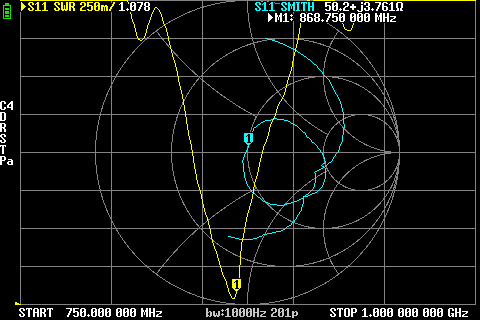

# EByte TX868-BLG-55 (868 MHz)

## Where to buy

- [Ozon / Taube Store](https://www.ozon.ru/product/antenna-8dbi-868mgts-cdebyte-tx868-blg-55-1643595859/)

## Links

- [Official site](https://www.cdebyte.com/products/TX868-BLG-55)
- [Datasheet](https://www.cdebyte.com/pdf-down.aspx?id=1918)

## Measurements

### 868 MHz

SWR: `1.078`

Impedance: `50.2 Ω`, `j3.761`

Screenshots

