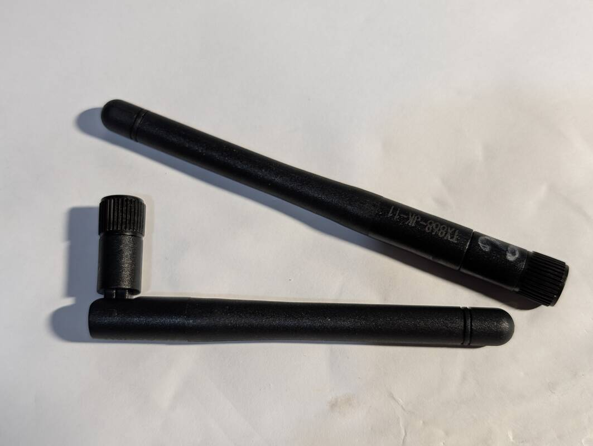
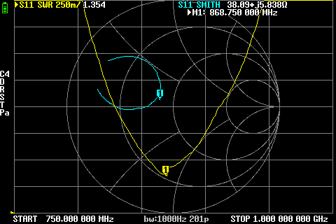
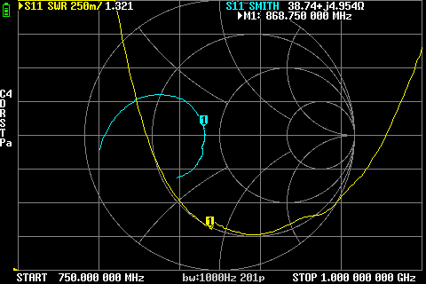
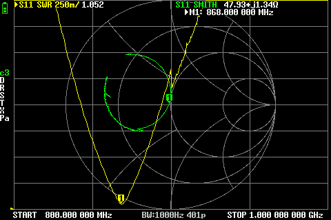

# EByte TX868-JK-11 (868 MHz)

## Where to buy

- [Ozon / Платан-Энерго](https://www.ozon.ru/product/tx868-jk-11-antenna-868mgts-2-5dbi-50om-20vt-sma-j-11sm-2235739151/)

## Links

- Datasheet: https://doc.platan.ru/pdf/datasheets/ebyte/TX868-JK-11.pdf

## Declared specs

Gain: `2.5dBi`

## Measurements

> [!IMPORTANT]
> A total of 3 antennas was measured: antenna 1 and 2 was measured by repo owner and antenna 3 was purchased and measured by a contributor. Measurment conditions vary greatly, and the results are hard to compare.

### 868 MHz

**Antenna 1:**

SWR: `1.354`

Impedance: `38.09 Ω`, `j5.838`

**Antenna 2:**

SWR: `1.321`

Impedance: `38.74 Ω`, `j4.954`

**Antenna 3:**

SWR: `1.052`

Impedance: `47.93 Ω`, `j1.34`

Screenshots

