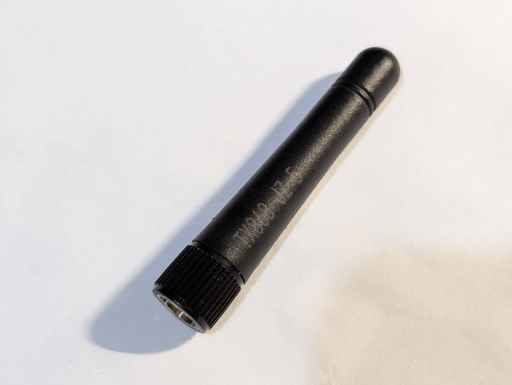
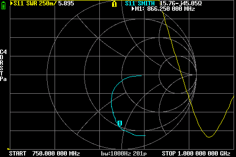

# EByte TX868-JZ-5 (868 MHz)

## Where to buy

- [ChipDip](https://www.chipdip.ru/product0/8033619951)

## Links

- Official site: https://www.cdebyte.com/products/TX868-JZ-5/4
- Datasheet: https://www.cdebyte.com/pdf-down.aspx?id=2638

## Declared specifications

Gain: `2dBi`

## Measurements

### 868 MHz

SWR: `5.895`

Impedance: `15.76 Ω`, `-j45.05`

> [!IMPORTANT]
> ~~Only one antenna was measured, so it's not unrealistic to assume that it could be a defective item. But it's also a good idea to order it in a store where you can return it easily if the problem occurs.~~
> A total of 7 antennas was measured. All of them were tuned to ~950MHz instead of 868MHz. Even on ~950MHz they had SWR of ~1.6 which is more than declared on the product page.

Screenshots

