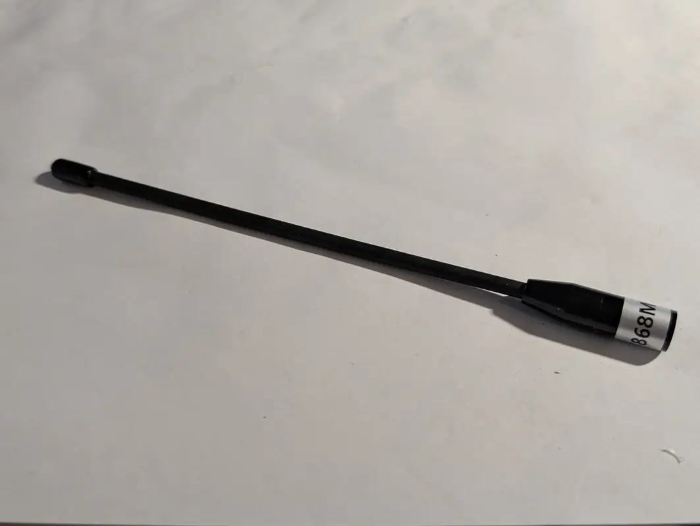
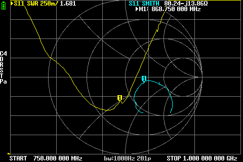
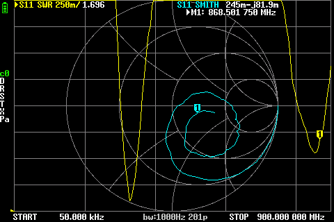

# Gizont Nb-iot / LoRa Soft Antenna M1 (167 mm, 868 MHz)

## Where to buy

- [Aliexpress / GIZONT Antenna Store](https://aliexpress.ru/item/1005007503836549.html), select "868MHz SMA M 1" option

## Declared specs

Gain: `10dBi` (quote from Aliexpress item page)

> [!IMPORTANT]
> The declared gain of `10dBi` is most likely fake or highly exaggerated.
> This antenna is either an assymmetric dipole or a monopole considering it's composition. Treat this value with skepticism.

## Measurements

### 868 MHz

SWR: `1.681`

Impedance: `80.24 Ω`, `-j13.86 Ω`

Screenshot

### 868 MHz (wide view)

SWR: `1.696`

Impedance: <...>

Screenshot

 
