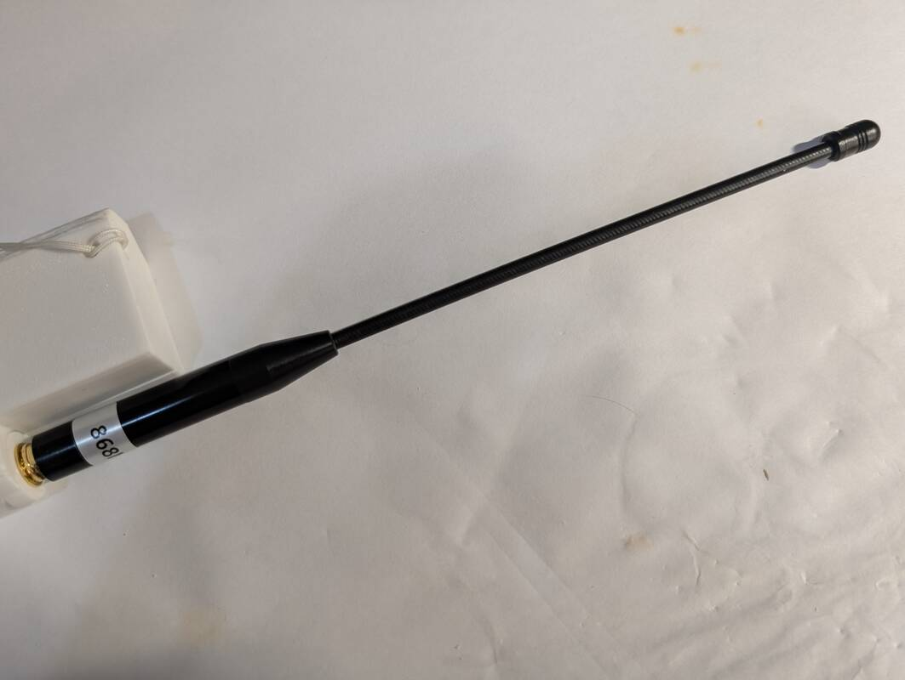
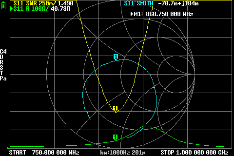
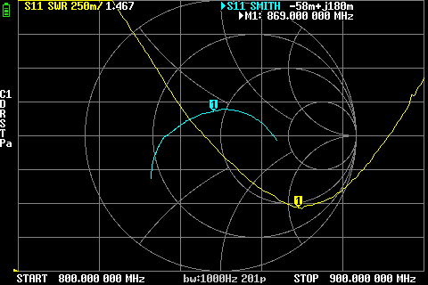
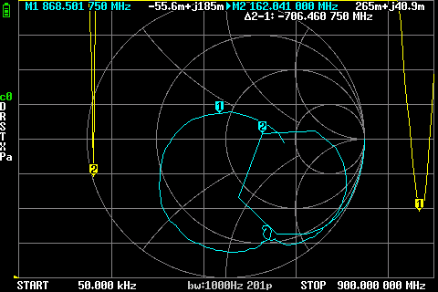

# Gizont Nb-iot / LORA Soft Antenna M2 (200 mm, 868 MHz)

## Where to buy

- [Aliexpress / GIZONT Antenna Store](https://aliexpress.ru/item/1005007503836549.html), select "868MHz SMA M 2" option

## Declared specifications

Gain: `10dBi` (quote from Aliexpress item page)

> [!IMPORTANT]
> The declared gain of `10dBi` is most likely fake or highly exaggerated. Treat this value with skepticism.

## Measurements

### 868 MHz

SWR: `1.490`
Impedance: `40.73 Ω`, `j184m`

Screenshot

### 868 MHz (old)

SWR: `1.467`
Impedance:

screenshot

### 868 MHz and 160 MHz resonance (old)

**868 MHz:**

SWR:

Impedance:

**162 MHz:**

SWR:

Impedance:

Screenshot

