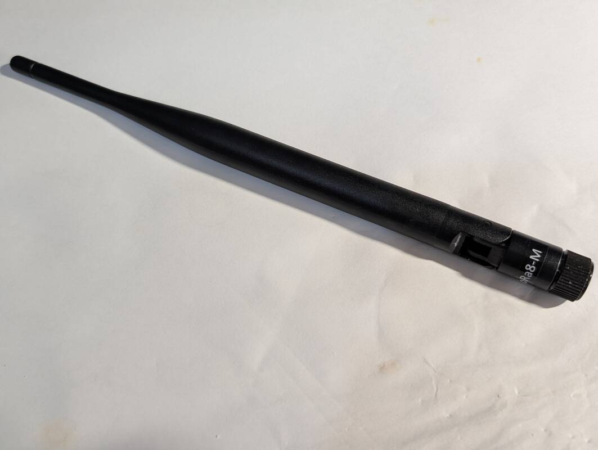
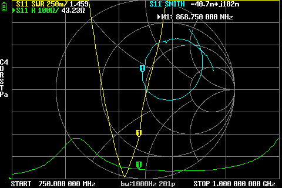

# NoName angled dipole antenna from Ozon (200 mm, 868 MHz)

## Where to buy

- [Ozon / "Проснаб"](https://www.ozon.ru/product/antenna-868-mgts-lora-lorawan-2sht-upakovka-1847411655/), select "868MHz SMA M 2" option

## Declared specifications

Gain: `5dBi` (quote from Ozon item page)

> [!IMPORTANT]
> The declared gain of `5dBi` is most likely fake. Inside the case is just a simple dipole antenna, so the real gain is expected to be much lower.

## Measurements

### 868 MHz, straight

SWR: `1.208`

Impedance: `46.04 Ω`, `j88m`

screenshot

### 868 MHz, angled

SWR: `1.459`

Impedance: `43.23 Ω`, `j182m`

screenshot

