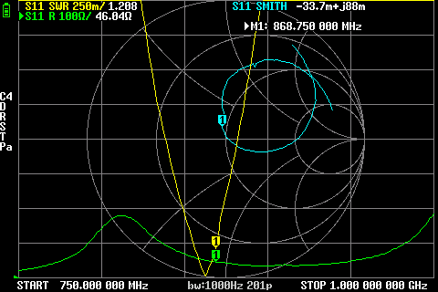
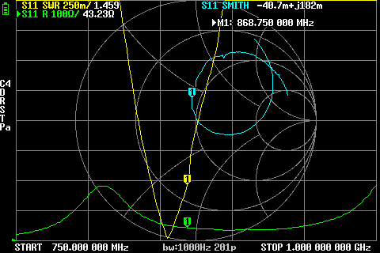
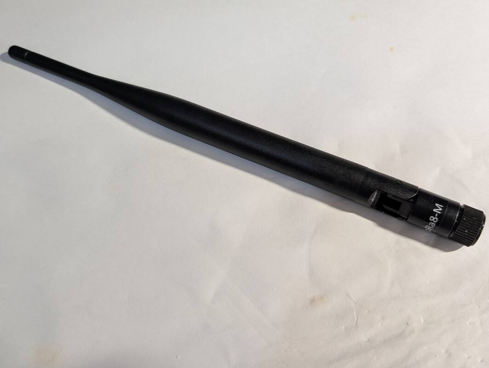

# NoName angled dipole antenna from Ozon (200 mm, 868 MHz)

## Where to buy

- [Ozon / "Проснаб"](https://www.ozon.ru/product/antenna-868-mgts-lora-lorawan-2sht-upakovka-1847411655/), select "868MHz SMA M 2" option

## Measurements

### 868 MHz, straight

SWR: `1.208`
Impedance: `46.04 Ω`, `j88m`

screenshot

### 868 MHz, angled

SWR: `1.459`
Impedance: `43.23 Ω`, `j182m`

screenshot

## Photos

Antenna photo

